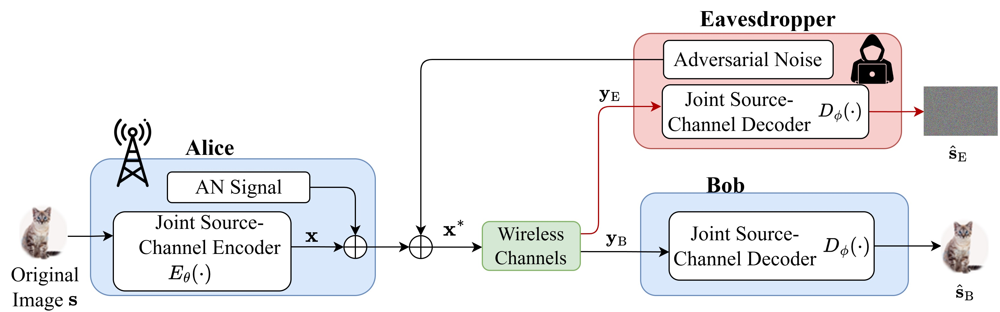

# Secure Semantic Communications with Adversarial Training and Active Eavesdropper

## Overview

This repository contains the implementation of the paper "Secure Semantic Communications with Adversarial Training and Active Eavesdropper".

## System Model



## Getting Started

### Requirements

Install requirements with:

```bash
pip install -r requirements.txt
```

## Usage
>If you want to train the model, please add '--enable-adversarial', '--enable-an'.

>If you want to test the model, please add '--adv-eval', '--enable-an', '--model-path'. 
```
python main.py --training --trainset {CIFAR10/DIV2K} --testset {CIFAR10/kodak/CLIC21} -- distortion-metric {MSE/MS-SSIM} --model {'SwinJSCC_w/o_SAandRA'/'SwinJSCC_w/_SA'/'SwinJSCC_w/_RA'/'SwinJSCC_w/_SAandRA'} --channel-type {awgn/rayleigh} --C {bottleneck dimension} --multiple-snr {random or fixed snr} --model_size {SwinJSCC model size}
```

## Citation

If you find this work useful for your research, please cite:
https://doi.org/10.1007/978-981-92-0074-0_32

## Acknowledgement

This implementation is built upon and inspired by the [SwinJSCC](https://github.com/semcomm/SwinJSCC) framework.  
We sincerely thank the authors of SwinJSCC for making their code publicly available and supporting open research in semantic communications.
